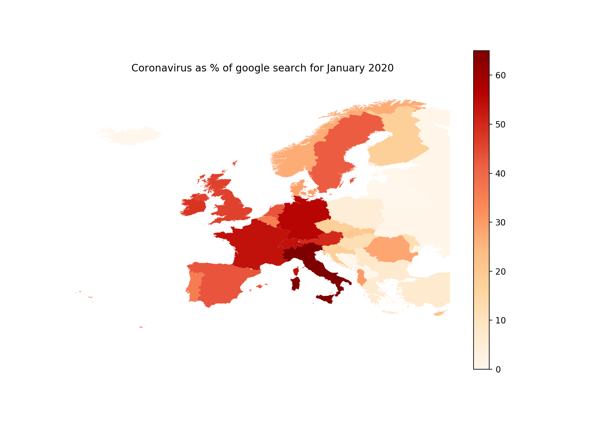

# coronavirus_search

Jupyter script exploring the google search on coronavirus during the month of January 2020.

Results by country in europe as percent of total search for the month of January:

